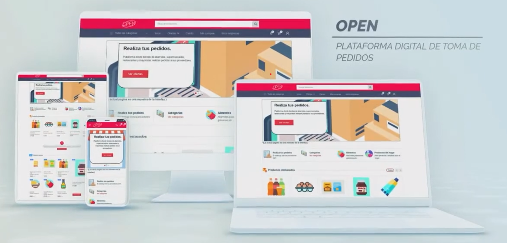
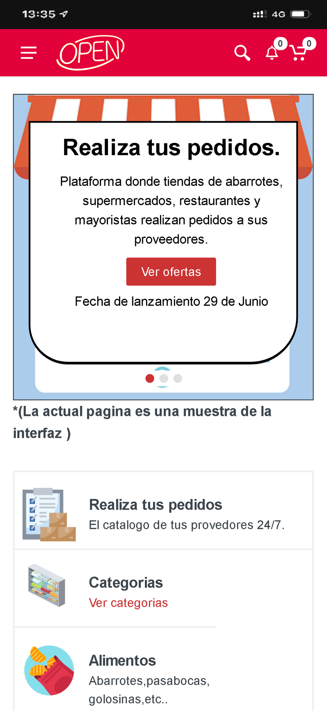
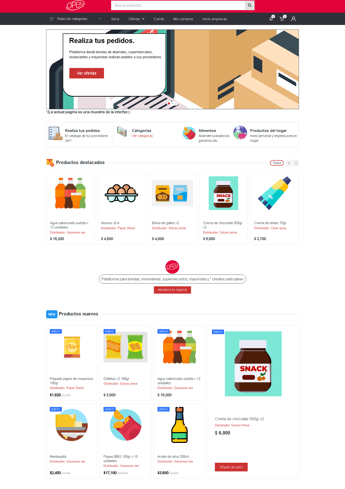
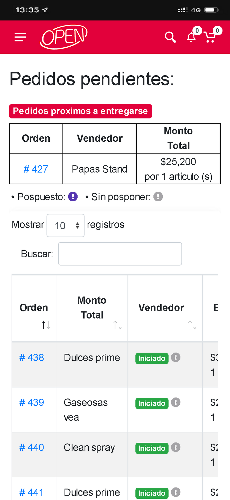
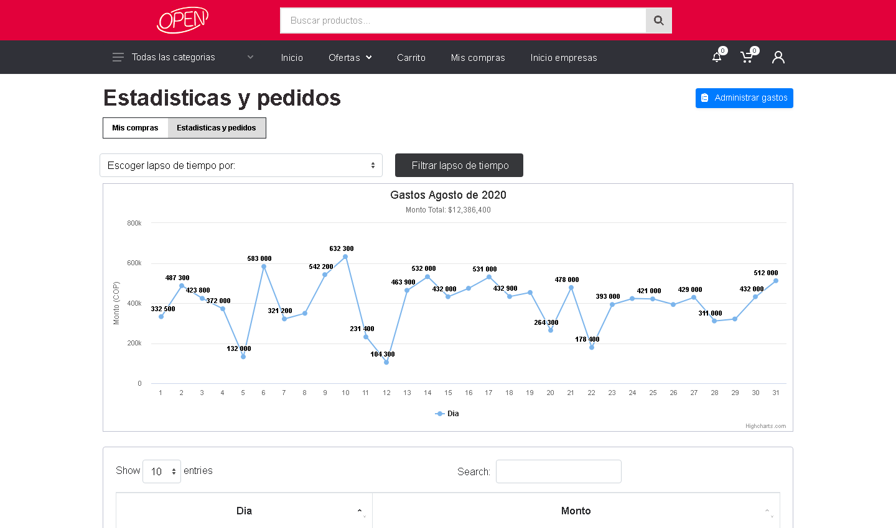
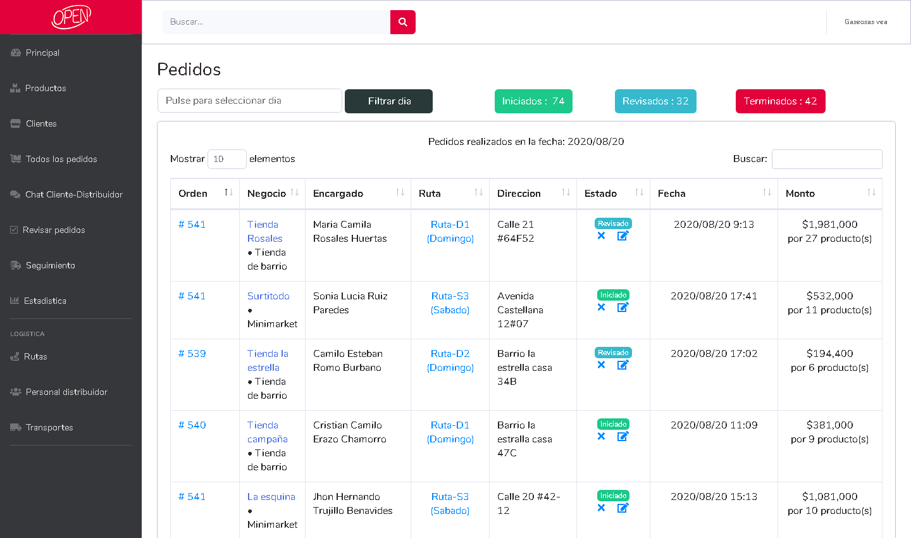

# 📦 OPEN – Plataforma de Logística y Pedidos para Empresas de Alimentos

OPEN es una plataforma web y móvil que digitaliza el proceso de ventas, pedidos, entregas y análisis para empresas del sector alimenticio. Con más de **30.000 descargas**, hemos ayudado a conectar empresas distribuidoras con sus clientes de forma más eficiente.

---

## 🎬 Demo en Video

---

## 🚀 ¿Qué es OPEN?

- 📲 **Catálogo de productos 24/7**
- 📦 **Pedidos programados con estado en tiempo real**
- 📈 **Estadísticas de ventas por producto, día y canal**
- 🔗 **Conectividad entre clientes, vendedores y repartidores**
- 📊 **Panel administrativo web para empresas**

OPEN facilita la transformación digital de empresas alimenticias en Latinoamérica, ayudando en cada parte del proceso: venta, gestión, entrega y análisis.

---

## 🧰 Tecnologías utilizadas

- **Frontend móvil:** Flutter
- **Backend:** Firebase (Auth, Firestore, Cloud Messaging)
- **Panel Web:** HTML, CSS, JavaScript
- **Mapas y rutas:** Google Maps API
- **Otros:** REST APIs, Realtime Database

---

## 📱 Interfaz Móvil

  
  
  

---

## 💻 Panel Web Administrativo

  
  

---

## 🧩 Arquitectura del Sistema

- Aplicaciones móviles (clientes, vendedores, repartidores)
- Panel Web para empresas
- Firebase para autenticación, base de datos y notificaciones
- Google Maps API para logística de entrega

---

## 🎞️ Flujo de Uso

> Desde el catálogo hasta la entrega y estadísticas en tiempo real.

---

## 📍 Visión

> OPEN busca cubrir gran parte de la demanda de alimentos digitalizando los canales tradicionales de venta y entrega, optimizando la relación entre fabricantes, distribuidores y minoristas.

---

## 📬 Contacto

Desarrollado por **Cristian Eraso**  
📧 cael04311@gmail.com  
📞 +57 316 377 9791  
🔗 [LinkedIn](https://www.linkedin.com/in/cristian-eraso-b41221161/)

---

## 🛡️ Licencia

Este proyecto está disponible bajo la [Licencia MIT](./LICENSE).

